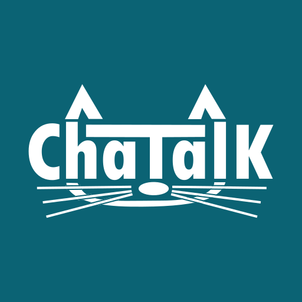
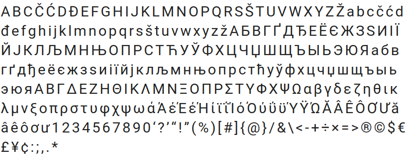
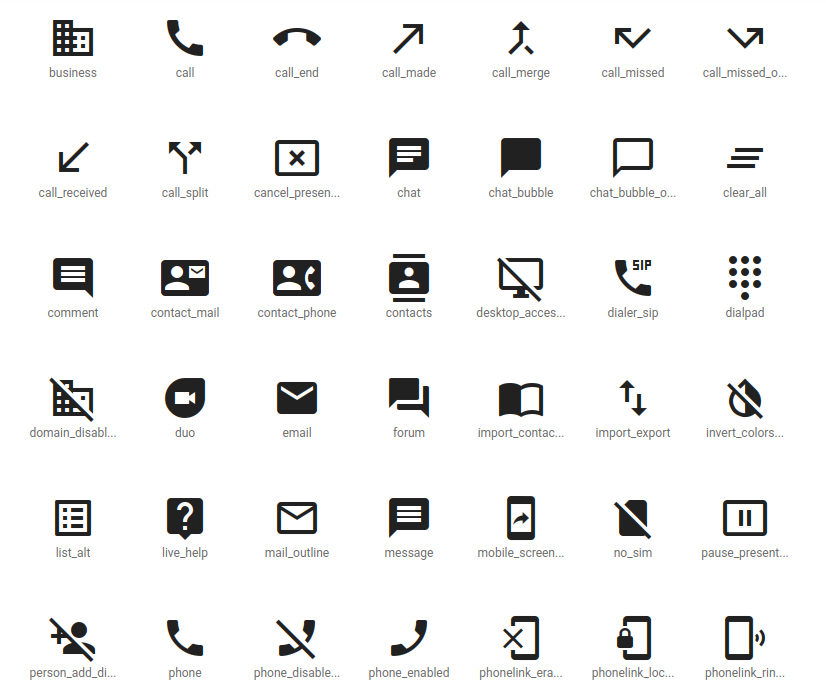
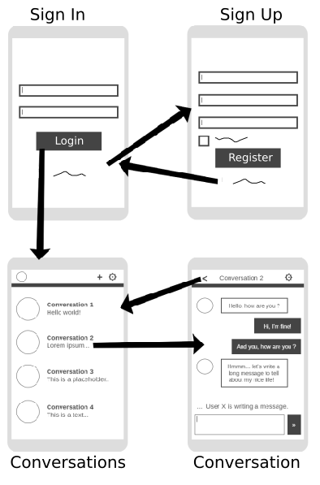

## Visual identity

We decided to have a logo to represent our application.

The logo is composed of a black sans-serif bold text on wich is written the name of our application in the following case `ChaTalK`.
Notice the upper `C`, `T` and `K`.

There are six mustaches representing the six members of the group for this project.

For some occasions, we will use the following variant of our logo:

## Colors

The applications will propose, if we have time, two themes.

We will use a color, a specific blue, to highlight things like buttons.
This will be our primary color.

Here are the specifications of our main color:

- HEX: `#0b6374`
- RGB: `11, 99, 116`
- CMYK: `91%, 15%, 0%, 55%`
- HSV: `190°, 91%, 45%`
- HSL: `190°, 84%, 25%`

### Light theme (default)

This will be the default color set of our application.

It will use white and light grey variants for colors.

### Dark theme

Will be done only if we have time to do it.

It will use dark colors, mostly black and dark grey variants.

The goal of this theme is to save battery and to be used in the night.

## Typography

The application aims to be user-friendly.
To offer a nice user experience, we decided to use a simple sans-serif font.

We choosed the [Roboto](https://fonts.google.com/specimen/Roboto) font.

Here is a list of all characters defined in this font:

Here is a preview of the font in different variants (font weight, italic, ...):

## Icons

We will use the icons provided by the Material Design here: https://material.io/resources/icons/.

To give you an idea of what kind of icons they provide, here is a sample of some of their icons:

## Layout

The layout of the application will be quite basic.

Here an idea of what we want to implement:

Conversations will be combined in a same view when using a large screen: the list of conversations will be in a left column and the conversation will be displayed to the right.

## Controls

The application will be optimised to be used from a computer, a tablet or a mobile phone having the latest version of a modern web browser.

Our tests will only target the latest version of Google Chrome on our devices.

We will not implement specific controls for vocal assistants for planning reasons.

## Licenses

The JavaScript library [ReactJS](https://reactjs.org/) is licensed under [MIT License](https://github.com/facebook/react/blob/master/LICENSE).

The [Roboto font](https://fonts.google.com/specimen/Roboto) is licensed under [Apache License 2.0](https://www.apache.org/licenses/LICENSE-2.0.html).

[Material icons](https://material.io/resources/icons) are licensed under [Apache License 2.0](https://www.apache.org/licenses/LICENSE-2.0.html).
