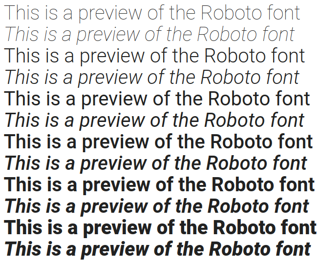

## Visual identity

We decided to have a logo to represent our application.

The logo is composed of a black sans-serif bold text on wich is written the name of our application in the following case `ChaTalK`.
Notice the upper `C`, `T` and `K`.

There are six mustaches representing the six members of the group for this project.

## Colors

The applications will propose, if we have time, two themes.

We will use a color, a specific blue, to highlight things like buttons.
This will be our primary color.

Here are the specifications of our main color:
- HEX: `#0b6374`
- RGB: `11, 99, 116`
- CMYK: `91%, 15%, 0%, 55%`
- HSV: `190°, 91%, 45%`
- HSL: `190°, 84%, 25%`

### Light theme (default)

This will be the default color set of our application.

It will use white and light grey variants for colors.

### Dark theme

Will be done only if we have time to do it.

It will use dark colors, mostly black and dark grey variants.

## Typography

The application aims to be user-friendly.
To offer a nice user experience, we decided to use a simple sans-serif font.

We choosed the [Roboto](https://fonts.google.com/specimen/Roboto) font.

## Icons

We will use the icons provided by the Material Design here: https://material.io/resources/icons/.

To give you an idea of what kind of icons they provide, here is a sample of some of their icons:

