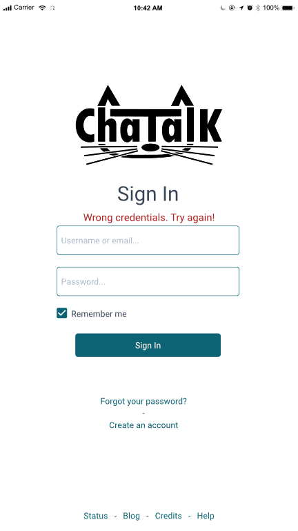
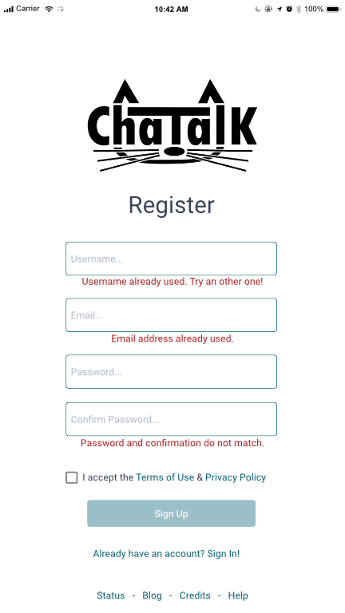
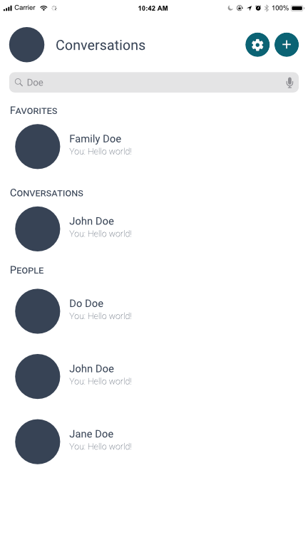
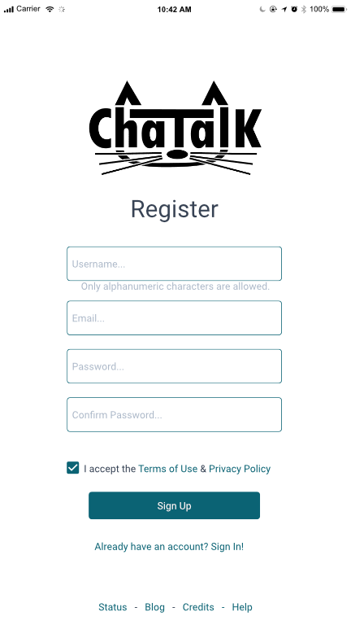
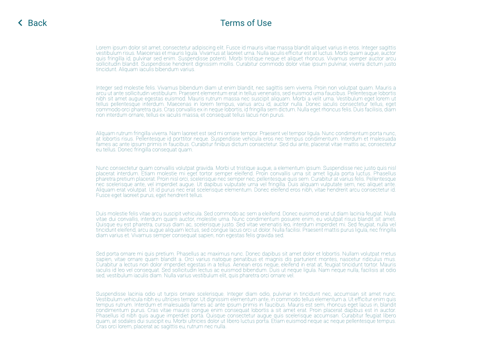
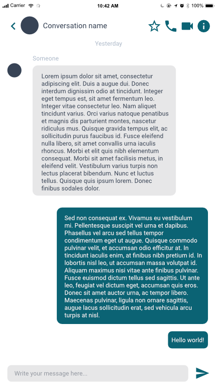
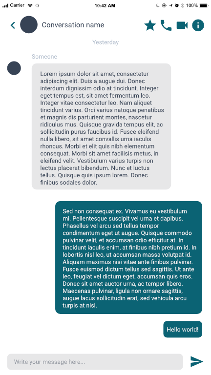
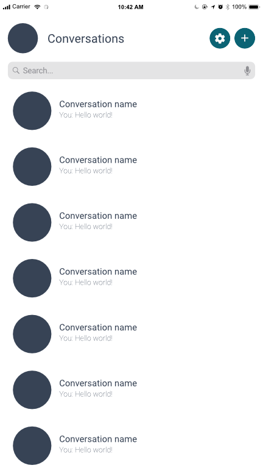
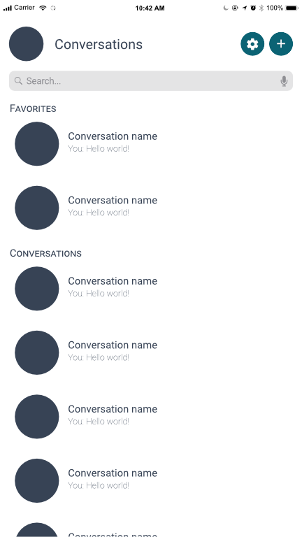

Hey all!

Here some nice updates since our [Mock-ups](/mock-ups/) blog post.

## Errors

We added some error messages that pop up when users do something wrong or a mistake.

### Login page

Here if user identifiants don't match with any identifiants in the data base that mean he write a wrong password or a wrong user/email.
The error message is quite explicit.

### Register page

For our application we want that each user have an unique username and an unique email. If an user want an username or an email that is already in the data base an error message will appear saying that it's already taken by another user.

If users do a mistake while typing in "confirm password" field and don't match with "password" field a message will also warn the user that he didn't write the same thing.

Once again error messages are explicit for easier understanding.

## Search results

Search bar will filter user conversations and show the ones that contain in their name the words in search bar.

Here an example with the word Doe in search bar.

If one section has no results, it will not be displayed.

## Help

## Favorite system

We added in conversation a little star icon that allow users to add a conversation to favorite.

When a conversation is in favorite the star is filled and user will see it at the top of his conversation list in the favorites categorie.

Some example of what will look like the favorite system.

### In conversation
Here conversation is not in favorite.

Conversation is in favorite.

### Conversation list

When user doesn't have favorite conversations.

When user has some favorite conversation.

