We designed some mock-ups in [Affinity Designer](https://affinity.serif.com/designer/).

They use all aspects we defined in the [Graphic Charter](/graphic-charter/) last week.

In this section we will describe each pages, what it contains and the link between pages.

## Sign In (Home page when logged off)

This page contains :

- Two fields to connect the first is your username or email, and the second is your password.
- One checkbox called "Remember me" to save your username or email and password for a futur login.
- One button Sign In to validate your login if it's good you will be redirected to the conversation page if not you will got a message that say you put a wrong password or email.
- Five hypertext links
  - "Forgot your password ?" will bring us to Password lost page.
  - "Create an account" will bring us to Sinp In page.
  - "Status"
  - "Blog" will bring us to the Blog.
  - "Credits" will bring us to Terms page.

### Mobile view of Sign In page
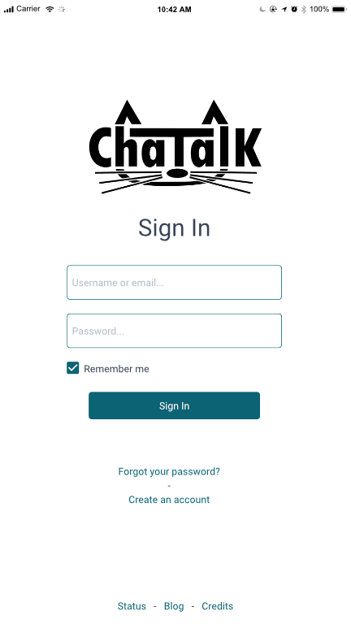
### Desktop view of Sign In page
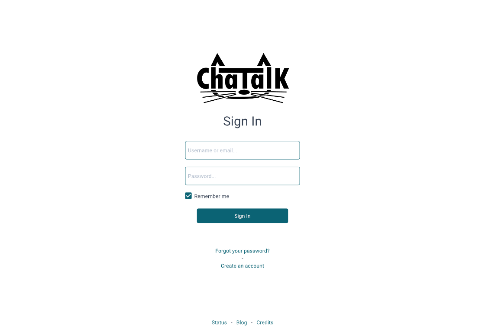

## Sign Up

This page will be use to create an account, it contains :

- Four Fields to complete which are username, email, password and confirm password.
- One checkbox "I accept the Terms of Use".
- One button Sign Up to validate the registration.
- Six hypertext links
  - "Terms of Use","Privacy Policy" and "Credits" bring us to Terms page.
  - "Status" and "Blog" are the same as the Sign In page.
  - "Already have an account..." goes back to Sign In page.

### Mobile view of Sign Up page
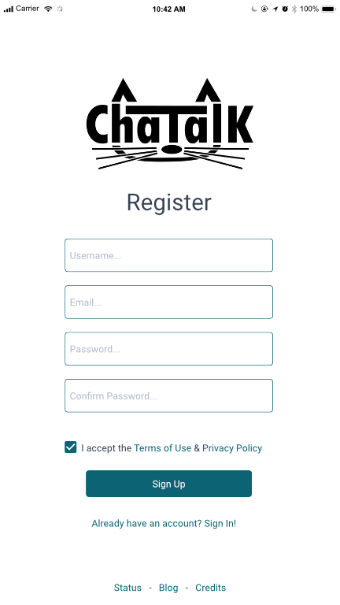

### Desktop view of Sign Up page
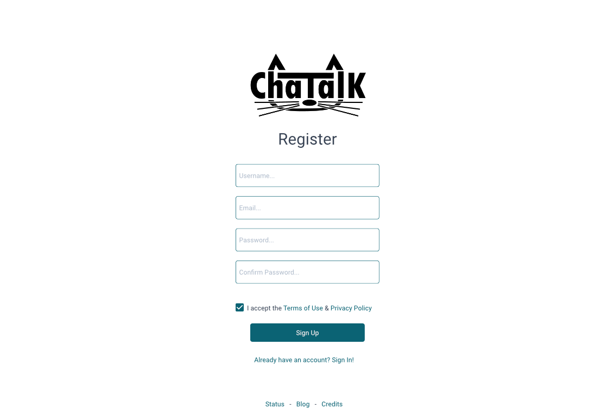

## Password lost

This page is here for members who lost their password, it contains :

- A field where we enter our username or email.
- A button to validate and receive an email for reset password.
- Four hypertext links
  - "Cancel" to go back to Sign In page.
  - "Status", "Blog" and "Credits" are the same as Sign In page.

### Mobile view of Password lost page
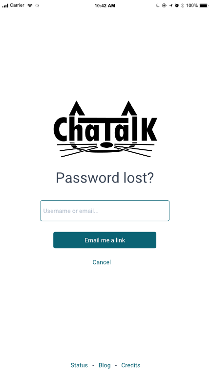

### Desktop view of Password lost page
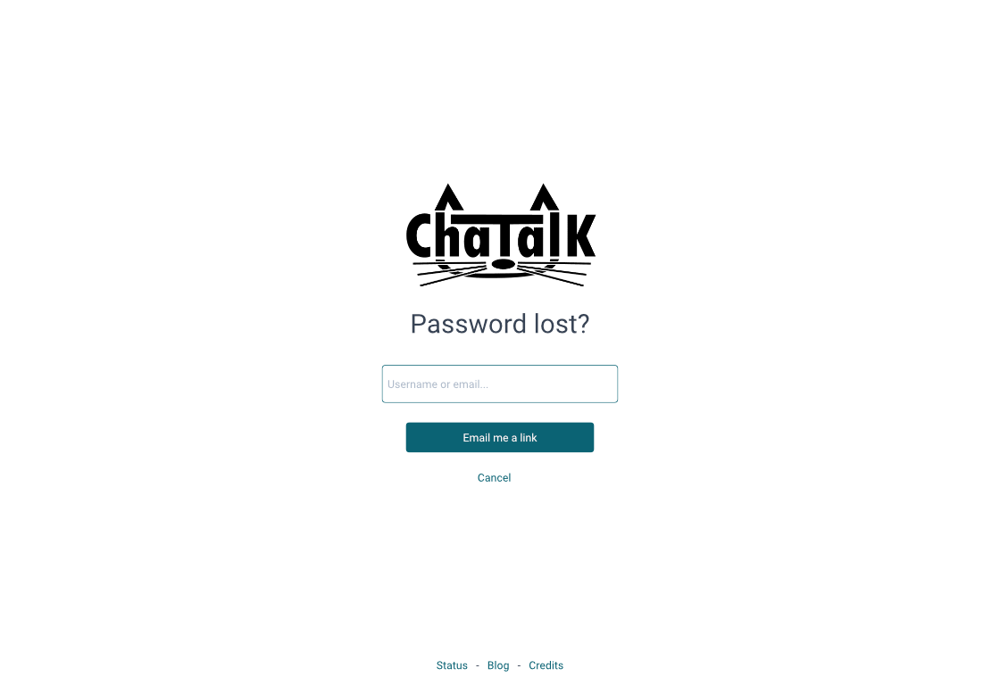

## Terms

This is a basic template for pages that have lot of text.

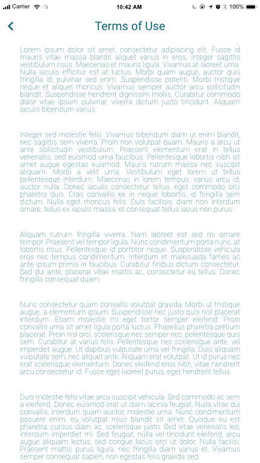

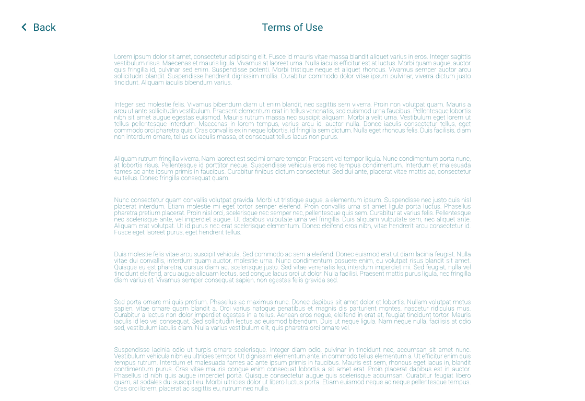

This page layout will be used for these pages:

- Terms of Use
- Policy Privacy
- Credits

## Conversations (Home page when logged in)

This page will be used to disccuss with other members,it contains :

- The list of all conversations and friends you had.
- The current conversation.
- A search bar.
- A fields to write some text and a send button to send the message.
- A few buttons represented by icons.
  - Those buttons can start and stop a video conversation :
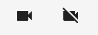
  - Those ones can start and stop an audio conversation :
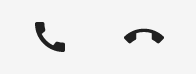
  - This one allows the member to add another member as friend.
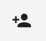
  - And this one allows you to access to the setting page.
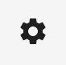

### Mobile views of Conversations page
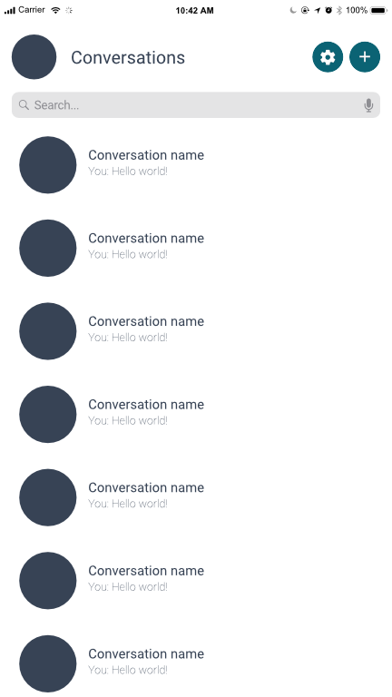

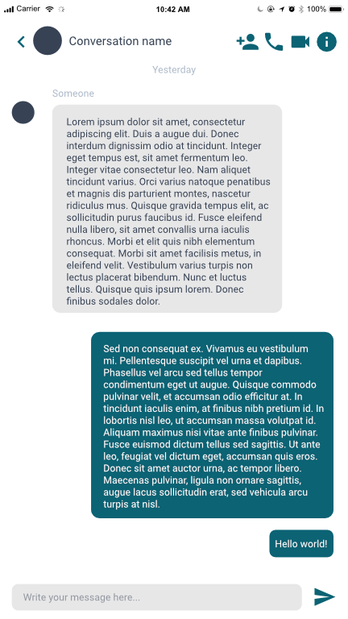

### Desktop view of Conversations page

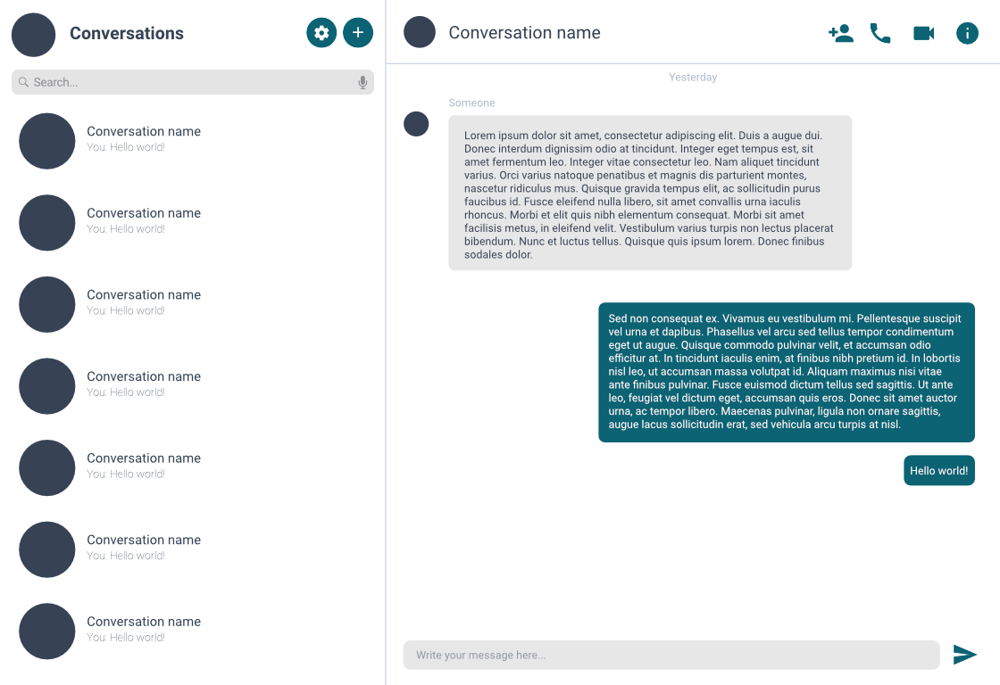

### Details

The desktop version always display the list of conversations and a conversation, which is two distincts things on the mobile version.
By default, it will open the most recent conversation.

In a conversation user message will be at right and other members message will be at left.

In a conversations with more than two members, messages will have the name of the user that send them.

The search bar lets the user find a conversation or person.

Friends will be listed firts in the persons list.

The "info" icon on a conversation has for the moment an unspecified behavior.
It will probably allow the user to rename a conversation, update the avatar and/or just display some informations about the conversation depending the time we have.

If we have time, we can implement an emoji-picker, a file uploader and so kind of features.

## Settings

In this page members can to modify info member and device :

- Fields to change your display name,username,email and password.
- Two Buttons dropdowns that allows you to choose your input device and output device for communications.
- One button sumbit to validate your new infos.
- Four hypertext
  - "Logout" that redirect to the Sign In page.
  - "Status", "Blog" and "Credits" are the same as Sign In page.

### Mobile views of Settings page
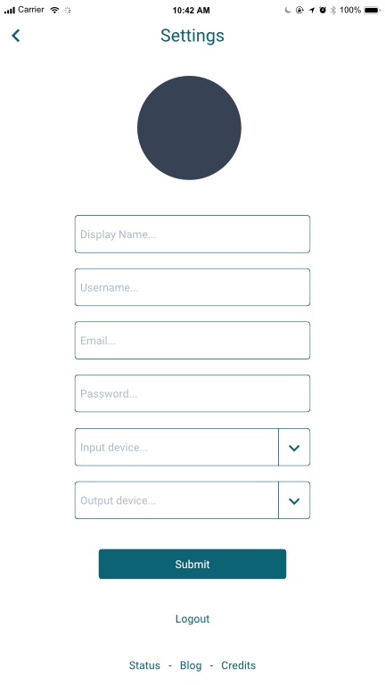

### Desktop view of Settings page
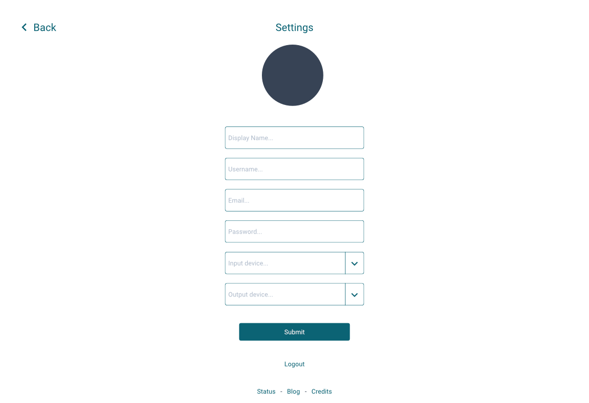
